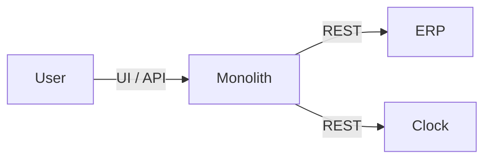
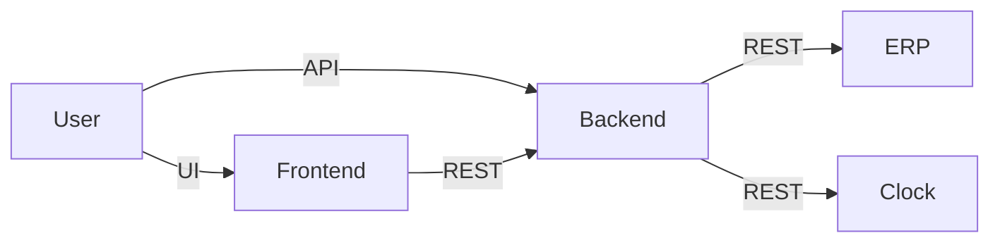
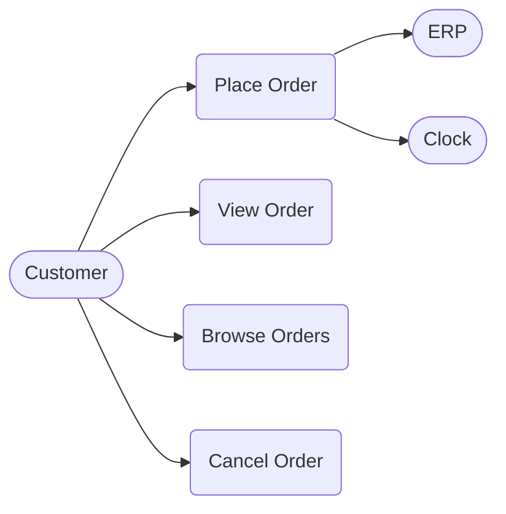

# MyShop

A catalog of project templates organized by two independent dimensions: **system** (the application) and **system-test** (the test harness). Each template is self-contained and copy-paste-ready.

## Verification

**meta-prerelease-stage** — runs the prerelease pipeline (local → commit → acceptance → QA) across all languages and architectures; tags the SHA as `meta-v<VERSION>-rc.<N>` on success. Does not release to production.
**meta-release-stage** — takes a meta-rc tag, orchestrates production releases across all 6 flavor prod-stages, tags `meta-v<VERSION>`, and bumps the root meta VERSION via `bump-patch-version-meta`. Each flavor's prod-stage bumps its own per-system VERSION (`system/<arch>/<lang>/VERSION`) post-release. This is the single canonical release path.

## Cleanup

Daily cleanup (23:00 UTC) of superseded deployments, prerelease git tags, GitHub releases, and Docker image tags.

## Architecture

### Monolith

### Multitier

## Use Cases

## System Templates

Pick based on your architecture and language:

### Monolith

| Language | Directory | Framework | Port | SonarCloud |
|---|---|---|---|---|
| Java | `system/monolith/java/` | Spring Boot + Thymeleaf (SSR) | 8080 | [shop-monolith-java](https://sonarcloud.io/project/overview?id=optivem_shop-monolith-java) |
| .NET | `system/monolith/dotnet/` | ASP.NET Core Razor Pages | 8080 | [shop-monolith-dotnet](https://sonarcloud.io/project/overview?id=optivem_shop-monolith-dotnet) |
| TypeScript | `system/monolith/typescript/` | Next.js (SSR) | 3000 | [shop-monolith-typescript](https://sonarcloud.io/project/overview?id=optivem_shop-monolith-typescript) |

### Multitier

#### Frontend

| Language | Directory | Framework | Port | SonarCloud |
|---|---|---|---|---|
| TypeScript | `system/multitier/frontend-react/` | React + Nginx | 8080 | [shop-multitier-frontend-react](https://sonarcloud.io/project/overview?id=optivem_shop-multitier-frontend-react) |

#### Backend

| Language | Directory | Framework | Port | SonarCloud |
|---|---|---|---|---|
| Java | `system/multitier/backend-java/` | Spring Boot API | 8081 | [shop-multitier-backend-java](https://sonarcloud.io/project/overview?id=optivem_shop-multitier-backend-java) |
| .NET | `system/multitier/backend-dotnet/` | ASP.NET Core API | 8081 | [shop-multitier-backend-dotnet](https://sonarcloud.io/project/overview?id=optivem_shop-multitier-backend-dotnet) |
| TypeScript | `system/multitier/backend-typescript/` | NestJS API | 8081 | [shop-multitier-backend-typescript](https://sonarcloud.io/project/overview?id=optivem_shop-multitier-backend-typescript) |

## System-Test Templates

Pick based on your preferred test language (independent of system language):

| Language | Directory | Framework |
|---|---|---|
| Java | `system-test/java/` | JUnit 5 + Playwright |
| .NET | `system-test/dotnet/` | xUnit + Playwright |
| TypeScript | `system-test/typescript/` | Jest + Playwright |

Each system-test includes docker-compose files for both architectures in `local` and `pipeline` variants (e.g. `docker-compose.local.monolith.real.yml`, `docker-compose.pipeline.multitier.stub.yml`). Remove the files for the architecture you don't need.

## CI/CD Pipelines

The `.github/workflows/` directory contains runnable pipelines for all 6 matched-language combinations (system + system-test):

### Monolith Java

### Monolith .NET

### Monolith TypeScript

### Multitier Java

### Multitier .NET

### Multitier TypeScript

- **Commit stages** trigger automatically on push via path filters
- **Acceptance/QA/Prod stages** are workflow_dispatch (manual trigger)
