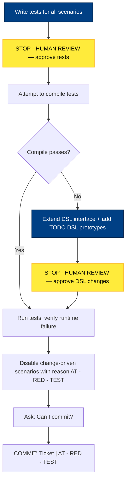
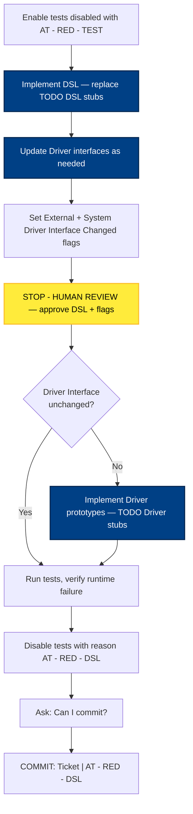
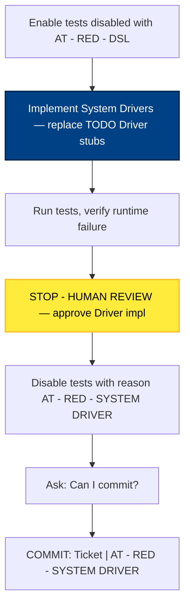
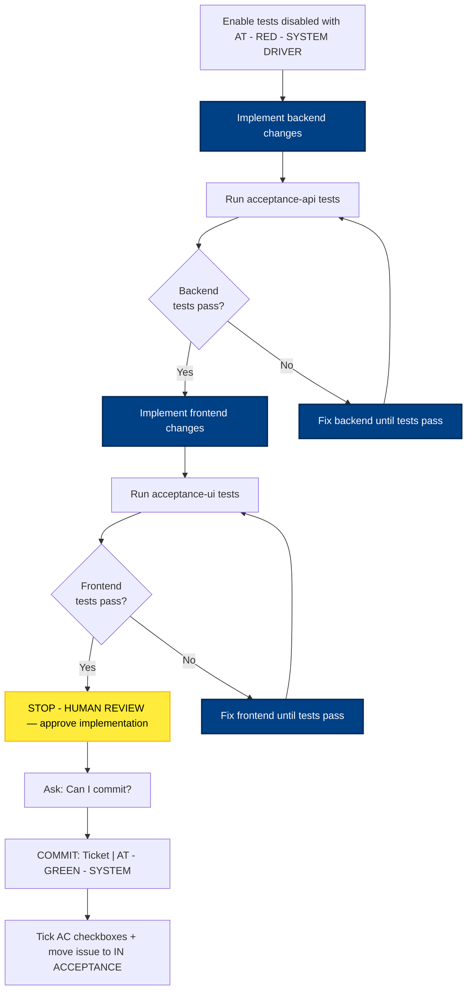
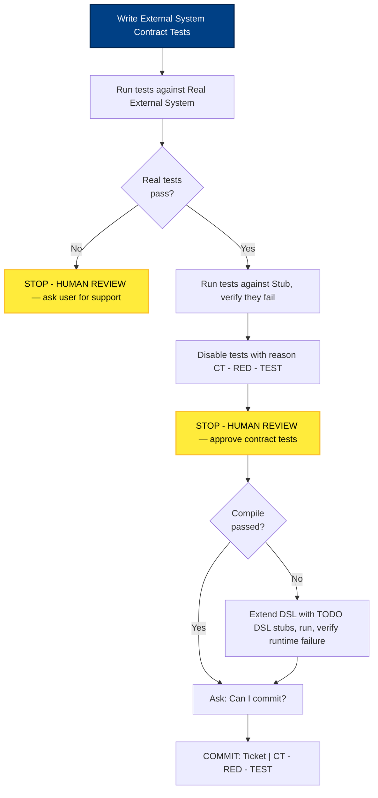
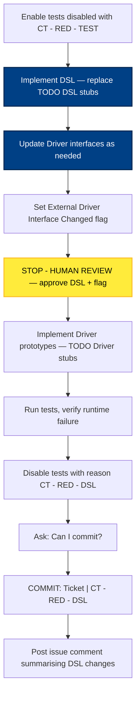
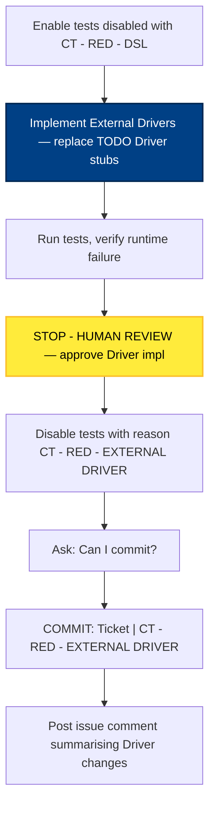
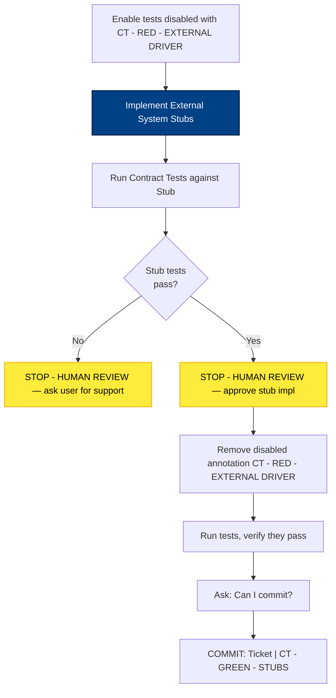

# Phase Details Diagram

> Generated by the `diagram-generator` agent from the prose docs in `docs/atdd/process/`. Overwritten on every run — do not edit by hand; edit the source docs and regenerate.

## Source docs

- `docs/atdd/process/at-cycle-conventions.md`
- `docs/atdd/process/at-green-system.md`
- `docs/atdd/process/at-red-dsl.md`
- `docs/atdd/process/at-red-system-driver.md`
- `docs/atdd/process/at-red-test.md`
- `docs/atdd/process/ct-cycle-conventions.md`
- `docs/atdd/process/ct-green-stubs.md`
- `docs/atdd/process/ct-red-dsl.md`
- `docs/atdd/process/ct-red-external-driver.md`
- `docs/atdd/process/ct-red-test.md`
- `docs/atdd/process/shared-phase-progression.md`

Cycle-level orchestration is owned by `gh-optivem`; see the rendered [process-flow diagram](https://github.com/optivem/gh-optivem/blob/main/docs/process-flow-diagram.md).

## AT - RED - TEST Phase Detail

## AT - RED - DSL Phase Detail

## AT - RED - SYSTEM DRIVER Phase Detail

## AT - GREEN - SYSTEM Phase Detail

## CT - RED - TEST Phase Detail

## CT - RED - DSL Phase Detail

## CT - RED - EXTERNAL DRIVER Phase Detail

## CT - GREEN - STUBS Phase Detail

