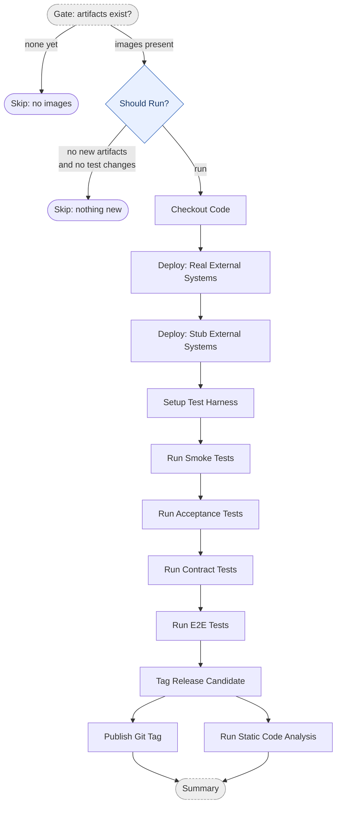

# Acceptance Stage

The acceptance stage runs on a schedule (hourly) and on demand. It deploys the
images produced by the commit stage into an acceptance-like environment, runs the
full system test suite against real and stubbed external systems, and — when the
tests pass — tags a release candidate (RC) and publishes the git tag.

This diagram shows the **conceptual** stages. The real workflow YAML has more steps
(setup, logins, wait-for-endpoints, retry, version compose), each of which belongs to
the conceptual box it supports — see [Diagram ↔ YAML mapping](#diagram--yaml-mapping).

## Pipeline

- **Gate: artifacts exist?** and **Should Run?** are orchestration gates, not pipeline stages. The first skips when the commit stage has not published images yet; the second skips when there are no new artifacts since the last run *and* no test/workflow changes since the last RC tag (the `force-run` input bypasses it).
- **Deploy** brings the system up twice — once wired to real external systems, once to stubs — each followed by a wait-for-endpoints health check. Both environments stay up so the test suites can target whichever they need.
- **Run … Tests** is the full system suite split by category (smoke, acceptance, contract, e2e), each invoked per-suite so a failure surfaces as a specific named step.
- **Tag Release Candidate** reads the base VERSION, composes an `rc` version from the run number, and tags the deployed images. **Publish Git Tag** and **Run Static Code Analysis** (Sonar) then run in parallel off the tagged RC.
- A `debug-skip-tests` input bypasses deployment and tests to tag an RC anyway — for pipeline-plumbing iteration only, never a real release path.

## Diagram ↔ YAML mapping

Alignment covers the **`run` job** plus the two gate jobs (`preflight`, `check`) and the
sibling `publish-tag` / `sonar` jobs that hang off it. Each conceptual box absorbs the
supporting YAML steps below it so the diagram can be diffed against the YAML. Every box
carries a `# === <Box> ===` anchor in the YAML: whole-job boxes (`preflight`, `check`,
`publish-tag`, `sonar`) anchor at the job key; the in-`run` boxes anchor at the first step
of their group. The `summary` job is orchestration and is not part of the alignment.

| Diagram box | YAML steps / job |
|---|---|
| Gate: artifacts exist? | `preflight` job: Check Container Packages Exist |
| Should Run? | `check` job: validate env vars, checkout, read base version, check tag exists, GHCR login, resolve image digests, get last run, check artifacts changed, detect test changes, Evaluate Run Gate |
| Checkout Code | Checkout Repository, Docker Hub login, GHCR login |
| Deploy: Real External Systems | Simulate Deployment (Real External Systems), Wait for Systems |
| Deploy: Stub External Systems | Simulate Deployment (Stub External Systems), Wait for Systems |
| Setup Test Harness | Setup toolchain, Setup Gradle/pre-warm, Cache Playwright, Install gh-optivem CLI, Setup Test Harness (`gh optivem test setup`) |
| Run Smoke Tests | `smoke-stub`, `smoke-real` |
| Run Acceptance Tests | `acceptance-parallel-api`, `acceptance-parallel-ui`, `acceptance-isolated-api`, `acceptance-isolated-ui` |
| Run Contract Tests | `contract-stub`, `contract-stub-isolated`, `contract-real` |
| Run E2E Tests | `e2e-api`, `e2e-ui` |
| Tag Release Candidate | Read Base System Version, Compose Prerelease Version, Tag Docker Images for Prerelease |
| Publish Git Tag | `publish-tag` job: Publish Git Tag |
| Run Static Code Analysis | `sonar` job: checkout, toolchain setup (per language), Run Sonar Analysis |

Workflows: `monolith-{dotnet,java,typescript}-acceptance-stage.yml`,
`multitier-{dotnet,java,typescript}-acceptance-stage.yml`.
