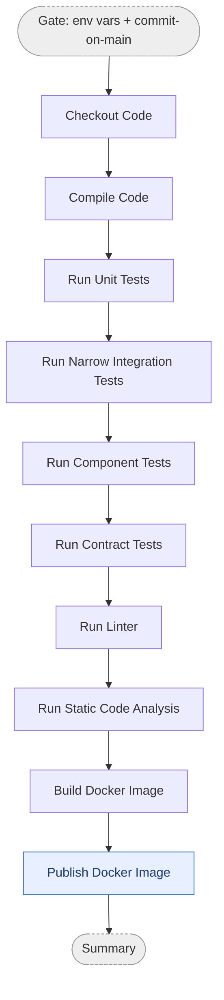

# Commit Stage

The commit stage runs on every push and pull request. It compiles the code, runs
the fast test layers, checks quality, and builds a Docker image — publishing it
only when the commit is on `main`.

This diagram shows the **conceptual** stages. The real workflow YAML has more steps
(setup, pre-warm, retry, registry login, metadata), each of which belongs to the
conceptual box it supports — see [Diagram ↔ YAML mapping](#diagram--yaml-mapping).

## Pipeline

- **Gate** and **Summary** are orchestration jobs, not pipeline stages.
- **Publish Docker Image** runs only on `main`; pull requests build the image but do not push it.

## Diagram ↔ YAML mapping

Each conceptual box absorbs the supporting YAML steps below it. Workflow files group
their steps under `# === <Stage> ===` headers so the diagram can be diffed against the YAML.

| Diagram box | YAML steps |
|---|---|
| *(Gate — not a box)* | Ensure Environment Variables Defined; Check Commit on Main |
| Checkout Code | Checkout Repository |
| Compile Code | Setup toolchain, pre-warm, Compile Code |
| Run Unit Tests | Run Unit Tests |
| Run Narrow Integration Tests | Run Narrow Integration Tests |
| Run Component Tests | Run Component Tests |
| Run Contract Tests | Run Contract Tests |
| Run Linter | Run Linter |
| Run Static Code Analysis | Build for analysis, Run Code Analysis |
| Build Docker Image | Setup Buildx, pre-pull base images, read/compose version, extract metadata |
| Publish Docker Image | Registry login, Build and Push (gated on `main`), Compose Digest URL |
| *(Summary — not a box)* | Summarize Stage |

Workflows: `monolith-{dotnet,java,typescript}-commit-stage.yml`,
`multitier-backend-{dotnet,java,typescript}-commit-stage.yml`,
`multitier-frontend-react-commit-stage.yml`.
