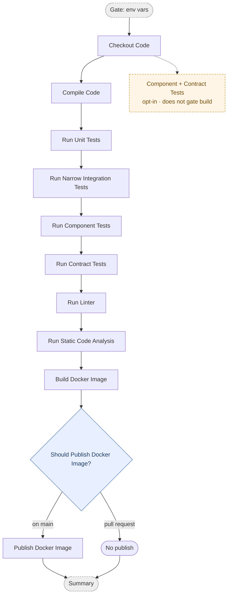

# Commit Stage

The commit stage runs on every push and pull request. It compiles the code, runs
the fast test layers, checks quality, and builds a Docker image — publishing it
only when the commit is on `main`.

This diagram shows the **conceptual** stages. The real workflow YAML has more steps
(setup, pre-warm, retry, registry login, metadata), each of which belongs to the
conceptual box it supports — see [Diagram ↔ YAML mapping](#diagram--yaml-mapping).

## Pipeline

- **Gate** and **Summary** are orchestration jobs, not pipeline stages.
- **Publish Docker Image** runs only on `main`; pull requests build the image but do not push it.
- The dashed **opt-in branch** runs the real component + contract tests in a separate parallel job that does not gate the image build/push. It exists only where wired up (e.g. `multitier-frontend-react`); on the main line, Component/Contract are skipped placeholders until implemented.

## Diagram ↔ YAML mapping

Alignment covers the **`run` job only** — each conceptual box absorbs the supporting
YAML steps below it so the diagram can be diffed against the YAML. Two marker styles:
stage boxes use `# === <Stage> ===` headers; decision diamonds (gates) use
`# <> <Decision?> <>`. The `check` (env-vars) and `summary` jobs are orchestration and
are not part of the alignment.

| Diagram box | YAML steps (in the `run` job) |
|---|---|
| Checkout Code | Checkout Repository |
| Compile Code | Setup toolchain, pre-warm, Compile Code |
| Run Unit Tests | Run Unit Tests |
| Run Narrow Integration Tests | Run Narrow Integration Tests |
| Run Component Tests | Run Component Tests |
| Run Contract Tests | Run Contract Tests |
| Run Linter | Run Linter |
| Run Static Code Analysis | Run Code Analysis (reuses Compile Code's build output; a separate build step only where the analyzer needs one) |
| Build Docker Image | Setup Buildx, pre-pull base images, read/compose version, extract metadata |
| Publish Docker Image | Registry login, Build and Push (gated on `main` via Check Commit on Main), Compose Digest URL |
| *(Opt-in branch — where wired up)* | `component-contract-tests` job: Run Component Tests (opt-in), Run Contract (Pact) Tests (opt-in) |

Workflows: `monolith-{dotnet,java,typescript}-commit-stage.yml`,
`multitier-backend-{dotnet,java,typescript}-commit-stage.yml`,
`multitier-frontend-react-commit-stage.yml`.
