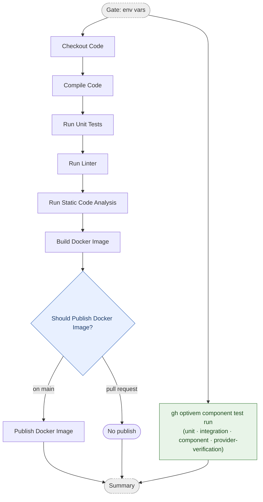

# Commit Stage

The commit stage runs on every push and pull request. It compiles the code, runs
the fast test layers, checks quality, and builds a Docker image — publishing it
only when the commit is on `main`.

This diagram shows the **conceptual** stages. The real workflow YAML has more steps
(setup, pre-warm, retry, registry login, metadata), each of which belongs to the
conceptual box it supports — see [Diagram ↔ YAML mapping](#diagram--yaml-mapping).

## Pipeline

- **Gate** and **Summary** are orchestration jobs, not pipeline stages.
- **Publish Docker Image** runs only on `main`; pull requests build the image but do not push it.
- **`gh optivem component test run`** runs all four suites (unit · narrow integration · component · provider-verification) via the declarative `component-tests.yaml` per component. It runs in a parallel `component-tests` job alongside `run` and gates the `summary` — failing it blocks the pipeline. Pending suites print a notice and pass; Docker-backed suites require the Docker daemon (provided on `ubuntu-latest`).
- **Narrow integration** exercises one adapter against a real dependency in isolation — no component boot, no full app start. Backends: `OrderRepository` ↔ Testcontainers-Postgres, `TaxGateway`/`ErpGateway` ↔ WireMock-in-Testcontainers. Frontend: `orderService` adapter ↔ in-process Pact mock server (no React render, no Docker). See [test taxonomy](../atdd/test-taxonomy.md) for the full four-layer model and the boot/render discriminator.
- **Consumer → `contracts/` → provider verification flow:** the frontend `integration` + `component` suites both emit into the committed `contracts/frontend-backend.json` (union of both suites' interactions); the backend `provider-verification` suite reads that committed file and runs provider verification. No inter-job artifact passing — the committed `.pact` is always current. `requiresDocker: false` on the backend provider-verification suite (provider verification uses WireMock + WebApplicationFactory, not Testcontainers).
- **The component-tier layer-4 suite is provider verification.** Named `Provider Verification (Pact)` with `id: provider-verification`, it runs the backend's `BackendPactVerificationTest`, which verifies the frontend consumer's committed `.pact` against the real provider. It exists **only on backends** (and the monolith) — the frontend is consumer-only and has **no** layer-4 suite; its consumer-contract emission lives in the `integration` + `component` suites. This is distinct from the external-system contract suites in `tests.yaml` (clock/erp/tax, stub-vs-real); both touch Pact/contracts, but the component-tier `provider-verification` suite is the in-process frontend↔backend provider check, not an external-system stub-vs-real comparison.
- **Local vs CI:** `gh optivem component test run` is the command that matches the CI gate. Bare `npm test` / `./gradlew test` / `dotnet test` run a fast, Docker-light subset and intentionally run *less* than CI. Use `--suite unit` for the fast inner loop, bare `run` to match CI.

## Diagram ↔ YAML mapping

Alignment covers the **`run` job only** — each conceptual box absorbs the supporting
YAML steps below it so the diagram can be diffed against the YAML. Two marker styles:
stage boxes use `# === <Stage> ===` headers; decision diamonds (gates) use
`# <> <Decision?> <>`. The `check` (env-vars) and `summary` jobs are orchestration and
are not part of the alignment.

| Diagram box | YAML steps |
|---|---|
| Checkout Code | Checkout Repository (`run` job) |
| Compile Code | Setup toolchain, pre-warm, Compile Code (`run` job) |
| Run Unit Tests | Run Unit Tests (`run` job; present for languages that also need it for Sonar coverage) |
| Run Linter | Run Linter (`run` job) |
| Run Static Code Analysis | Run Code Analysis (`run` job; reuses Compile Code's build output) |
| Build Docker Image | Setup Buildx, pre-pull base images, read/compose version, extract metadata (`run` job) |
| Publish Docker Image | Registry login, Build and Push (gated on `main` via Check Commit on Main), Compose Digest URL (`run` job) |
| gh optivem component test run | `component-tests` job: Install gh-optivem CLI Extension, Set Up Component Test Harness, Run Component Tests |

Workflows: `monolith-{dotnet,java,typescript}-commit-stage.yml`,
`multitier-backend-{dotnet,java,typescript}-commit-stage.yml`,
`multitier-frontend-react-commit-stage.yml`.
